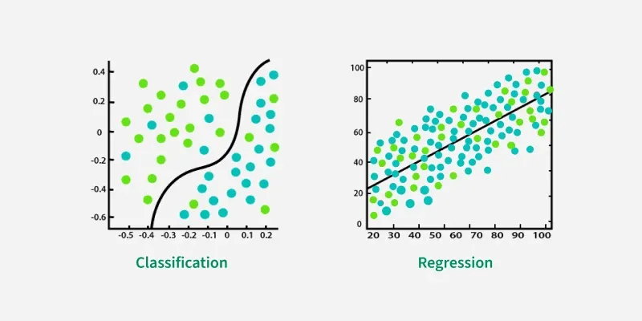
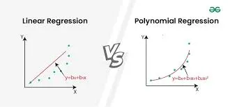
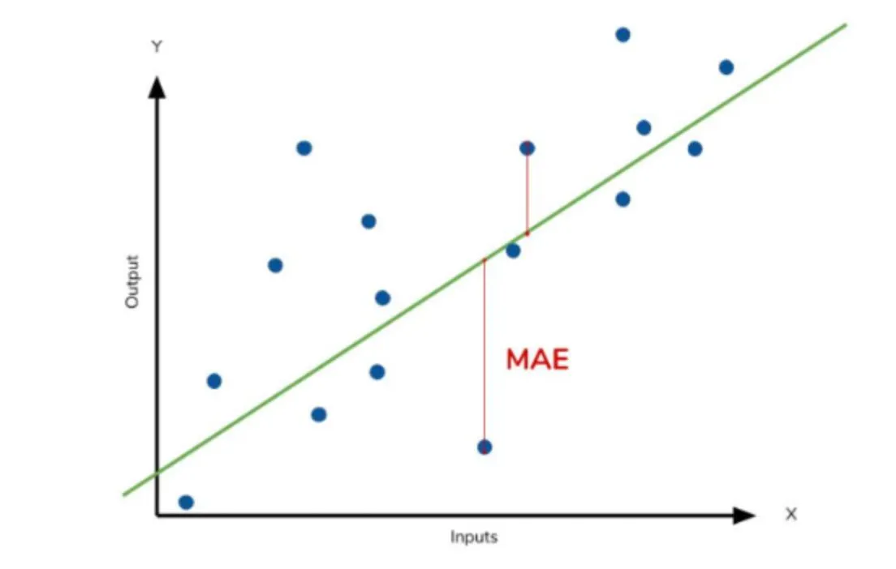
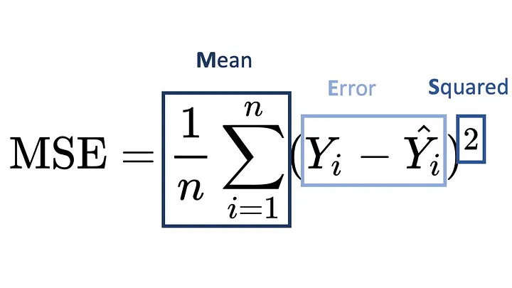
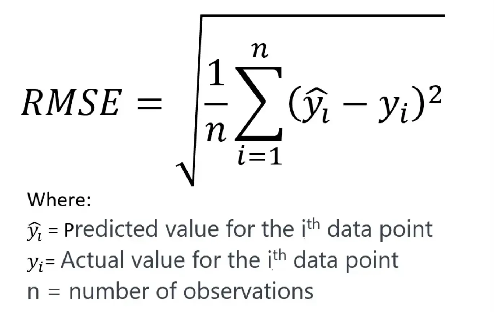
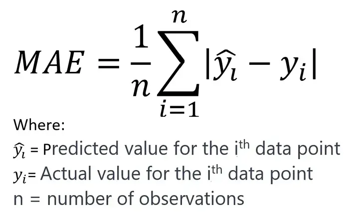
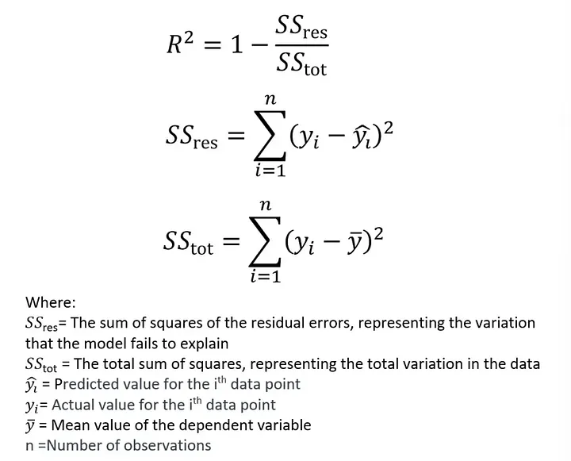
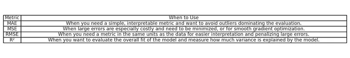
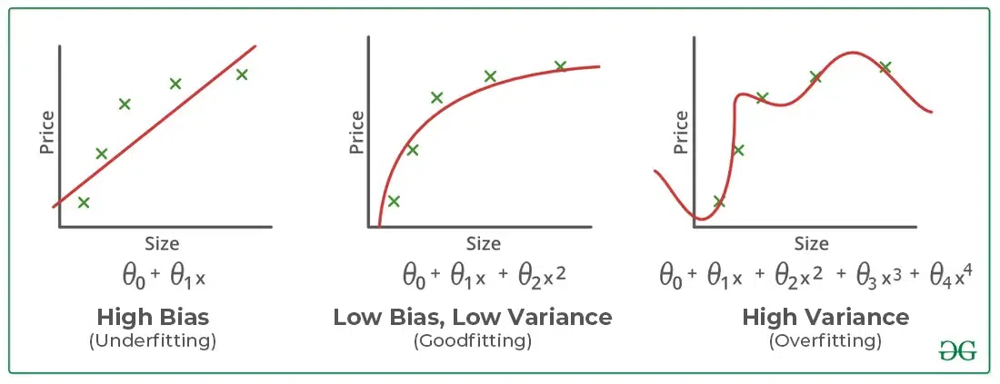
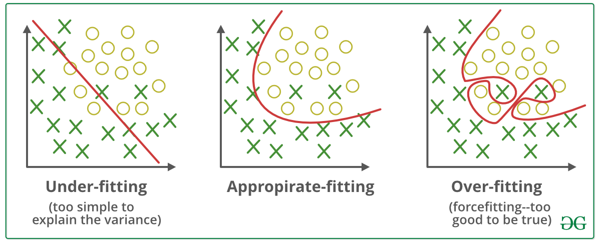

# Assignment 4

**1. Introduction to Regression**

- **Regression:** is a type of supervised learning used to predict continuous values based on input data. It estimates the relationships between variables to predict and explain various things, such as house prices, stock market trends, or weather conditions. Regression models map input features to a continuous target variable, enabling precise numerical predictions.

For example, using weather data from the past week, a regression model can forecast tomorrow’s rainfall. The values it predicts are continuous, meaning they can fall anywhere on a numerical scale—such as temperature measured to decimal points or sales revenue projected for upcoming months.[1]

- **Regression vs. classification:**  in Machine Learning
Classification and regression are two primary tasks in supervised machine learning, where key difference lies in the nature of the output: classification deals with discrete outcomes (e.g., yes/no, categories), while regression handles continuous values (e.g., price, temperature).

Both approaches require labeled data for training but differ in their objectives—classification aims to find decision boundaries that separate classes, whereas regression focuses on finding the best-fitting line to predict numerical outcomes. Understanding these distinctions helps in selecting the right approach for specific machine learning tasks.

For example, it can determine whether an email is spam or not, classify images as "cat" or "dog," or predict weather conditions like "sunny," "rainy," or "cloudy." with decision boundary and regression models are used to predict house prices based on features like size and location, or forecast stock prices over time with straight fit line.[2]

- **Give one real-life example of regression and one of classification**.
Imagine you work at a hospital predicting outcomes for incoming patients:

  - If you want to predict the number of days a patient stays, you’re solving a regression problem.
  - If you want to predict whether the patient needs ICU admission, that’s a classification problem.
  - If you're predicting a patient’s blood type—A, B, AB or O—you're dealing with nominal classification, where categories have no inherent order.
  - If you're forecasting the disease stage: early, moderate or severe, you're in the realm of ordinal classification—a hybrid that carries both class boundaries and order.

Both tasks assume that we have a ground truth. Without labeled examples (that is, known historical outcomes), both regression and classification are not feasible.

In the generative AI era, this is an important distinction. While large language models can generate outputs from unstructured prompts, they aren’t ideal in all cases for structured decision-making where precise, reliable targets matter. In these cases, labeled datasets and interpretable models remain essential.[3]

---
**2. Types of Regression**
Polynomial vs. Linear vs. Multiple Linear Regression

Regression analysis is a fundamental concept in machine learning and statistics, helping us understand relationships between variables. Among the various types of regression, Linear Regression, Multiple Linear Regression, and Polynomial Regression are widely used. This article explores each method, with a detailed focus on Polynomial Regression.

**1. Linear Regression**
What is Linear Regression?
Linear Regression is the simplest form of regression that models the relationship between a dependent variable (Y) and an independent variable (X) using a straight line. The equation for simple linear regression is:

Y=mX+bY = mX + b

Where:

- Y is the dependent variable
- X is the independent variable
- m is the slope (coefficient)
- b is the intercept

Example
If we want to predict a house’s price based on its size, we can use a straight-line relationship. However, linear regression assumes a linear relationship between X and Y, which may not always be the case.

Limitations

- Works well for simple relationships
- Cannot model curved trends in data
- Limited to one independent variable

**2. Multiple Linear Regression**
What is Multiple Linear Regression?
Multiple Linear Regression (MLR) extends simple linear regression by considering multiple independent variables. The equation is:

Y=b0+b1X1+b2X2+…+bnXnY = b_0 + b_1X_1 + b_2X_2 + … + b_nX_n

Where:

- Y is the dependent variable
- X_1, X_2, …, X_n are independent variables
- b_0 is the intercept
- b_1, b_2, …, b_n are coefficients for respective variables

Example
Predicting house prices based on size, location, and number of rooms. Multiple linear regression helps account for these factors simultaneously.

Limitations

- Assumes a linear relationship
- Sensitive to multicollinearity (when independent variables are correlated)
- Harder to interpret as the number of features increases

**3. Polynomial Regression (In Detail)**
What is Polynomial Regression?
Polynomial Regression is an extension of linear regression that models non-linear relationships by introducing polynomial terms (X², X³, etc.). It helps capture curved trends in data.

The equation for polynomial regression of degree 2 is:

Y=b0+b1X+b2X2Y = b_0 + b_1X + b_2X²

For higher degrees (degree = n):

Y=b0+b1X+b2X2+b3X3+…+bnXnY = b_0 + b_1X + b_2X² + b_3X³ + … + b_nX^n

Example
Consider predicting a car’s fuel efficiency based on speed. The relationship may not be linear but follow a parabolic trend:

- At lower speeds, efficiency is high
- At moderate speeds, efficiency increases
- At high speeds, efficiency drops

A straight line (linear regression) wouldn’t fit well, but a curve (polynomial regression) would capture the trend accurately.

Why Use Polynomial Regression?
✅ Captures non-linear relationships effectively
✅ Improves model flexibility
✅ Helps in trend prediction

Limitations
❌ Higher degrees can lead to overfitting
❌ Computationally expensive for large datasets
❌ Interpretation becomes complex

Comparison Table
Regression Type Equation Best for Limitations Linear Regression Y = mX + b Simple relationships Cannot model curves Multiple Linear Regression Y = b₀ + b₁X₁ + b₂X₂ + … Multiple features Prone to multicollinearity Polynomial Regression Y = b₀ + b₁X + b₂X² + … Non-linear trends Risk of overfitting

**When to Use Which Regression?**

- Use Linear Regression when data follows a straight-line pattern.
- Use Multiple Linear Regression when multiple factors affect the dependent variable.
- Use Polynomial Regression when the relationship is curved or non-linear.

Conclusion
Understanding the right regression technique is crucial in machine learning. While Linear Regression works well for simple relationships, Multiple Linear Regression expands to multiple features, and Polynomial Regression captures non-linearity effectively. Choosing the right model depends on data trends, complexity, and interpretability.

📌 Key Takeaway: If your data follows a curved pattern, Polynomial Regression is the best fit, but be cautious about overfitting![4]

**3. mse, mae, rmse, r² in regression**
in the context of Machine Learning, MSE (Mean Squared Error), RMSE (Root Mean Squared Error), MAE (Mean Absolute Error) and R² (Coefficient of determination or R Squared) are commonly used metrics to evaluate the performance of regression models. these metrics measure the error, which is the difference between the actual values and the predicted values, but they function differently. the goal is to determine which of these metrics is most appropriate depending on the model and specific objectives.

    2. Regression models concerned
Metrics such as MSE, MAE, RMSE, and R² are widely used in regression models, which predict a continuous numerical quantity. These models include techniques such as:linear regression

- decision trees in regression
- neural networks
random forests,
- (SVM) adapted for regression (SVR).

These models are used to predict continuous variables, whether they relate to economic data, environmental data, or human behavior.

    3. What is an error and why do we talk about It?
An error in a regression model is simply the difference between the observed actual value and the value predicted by the model. This error helps us understand how close our predictions are to the actual data; it is an indicator of the model’s ability to reflect the expected values compared to the observed values. A correct evaluation of these errors is essential to determine if a model is reliable or if it needs improvement.t.

In this context, **MSE, MAE, RMSE,** and **R²** measure this error in different ways:

- MSE and RMSE emphasize large errors.
- MAE treats each error equally.
- R² evaluates the proportion of variance explained by the model.

        4. MSE (Mean Squared Error) :

MSE is calculated by taking the mean of the squared errors, which are the differences between the actual values and the predicted values.
Squaring the errors has a particular impact: it amplifies significant errors.

For example, if an error is 10, it becomes 100 after squaring, whereas an error of 1 remains 1. This means that large errors will have a much stronger influence on the MSE.

- Penalizes large errors: Squaring the errors amplifies their impact, making this metric sensitive to significant prediction mistakes.
- Provides a smooth gradient, making it commonly used in optimization algorithms like gradient descent.

        5. RMSE (Root Mean Squared Error)

RMSE is simply the square root of the MSE. This brings the scale of the error back to the same units as the original data, making the RMSE easier to interpret. Like the MSE, the RMSE penalizes large errors more heavily, but it does so in a more intuitive format.

**Difference from the MSE:** The main difference is that the RMSE takes the square root of the MSE, which reduces the impact of large errors and provides an interpretation in the same units as the observed data, unlike the MSE, which provides squared units.

- Retains the sensitivity to large errors of MSE but presents the result in the same units as the target variable.
- More **intuitive to interpret** compared to MSE (e.g., if the RMSE is 2 hours, it’s directly meaningful).

        6. MAE (Mean Absolute Error) :

The MAE (Mean Absolute Error), on the other hand, is calculated by taking the mean of the absolute errors, which means it simply measures the absolute difference between the actual values and the predicted values without squaring the errors.

Here, the errors are treated uniformly, meaning an error of 10 and an error of 1 have an equivalent linear weight. Unlike the MSE, there is no squaring involved, so large errors are not amplified. This makes the MAE more robust to outliers, but it may be less sensitive to large-scale errors

- Treats all errors equally regardless of its size
- Robust to outliers : Since it doesn’t square the errors, large errors won’t overly influence the metric

        7. R² (R-squared)

R² measures the proportion of the variance in the data explained by the model. An R² close to 1 indicates that the model explains the variability of the data well, while an R² close to 0 indicates that the model explains very little of the variance.

**Difference from MSE, RMSE, and MAE:** R² measures how well the model fits the data, whereas the other metrics (MSE, MAE, RMSE) directly measure prediction error. R² is useful for understanding the proportion of variance explained, but it does not provide a direct measurement of error.

- **Measures the proportion of variance explained:** Indicates how well the model explains the variability in the target data.
- Bound between 0 and 1

        8. When to use them ?

**When do you need to use MSE?**
Use the MSE when you want to heavily penalize large errors. It is particularly useful in situations where significant errors can have severe consequences, and avoiding these large errors is crucial

Example:

magine you are a delivery company predicting the delivery time of packages. You have two packages:

**Package A:** The model predicts the package will arrive in 3 hours. In reality, it arrives in 3.5 hours. The error is therefore 0.5 hours
**Package B:** The model predicts the package will arrive in 3 hours. In reality, it arrives in 6 hours. The error is therefore 3 hours

The MSE calculates the squared error:

- **Error for Package A:** (3.5–3)² = (0.5)² = 0.25
- **Error for Package B:** (6–3)² = (3)² = 9
Thus, the MSE is:
**MSE = (0.25 + 9) / 2 = 4.625**

The MSE penalizes large errors much more severely. The error of 3 hours has a significantly stronger impact than the error of 0.5 hours.

**Why this is useful:**
The MSE’s strong penalty for large errors makes it particularly useful in situations where significant errors (such as long delays) are especially costly or unacceptable. For example, in the delivery sector, minimizing long delays is critical to maintain customer satisfaction and operational efficiency.

**When do you need to use RMSE?**
**RMSE** is similar to **MSE**, but it is **more intuitive** because it brings the error to the same scale as the original data. **RMSE** is particularly useful when large errors need to be penalized more significantly but in a unit comparable to the observed values.

Example:
Let’s revisit the delivery company example, but this time using RMSE to make the error more interpretable in the original units (hours in this case).

**Package A:** Prediction = 3 hours, Reality = 3.5 hours. Error = 0.5 hours.
**Package B:** Prediction = 3 hours, Reality = 6 hours. Error = 3 hours.
We already calculated the MSE as 4.625, but RMSE is simply the square root of the MSE:
**RMSE = √4.625 = 2.15**

**Why it’s useful:**
RMSE is in the same units as the data, making it more intuitive to interpret. For example, if the error is 0.5 hours, you know exactly what it means in terms of delivery time.
It penalizes large errors similarly to MSE but offers a more natural interpretation.

**When do you need to use MAE?**
MAE is preferable when you don’t want a few large errors to dominate the overall evaluation of the model. It is useful if your data contains outliers and you don’t want them to excessively influence the model’s performance. MAE is more stable and provides a fairer evaluation in situations where extreme errors should not be exaggerated.

Example:
Imagine you are a teacher predicting a student’s final grade based on previous test scores. You have two students:

**Student A:** Prediction = 80/100, Reality = 90/100. Error = 10 points.
**Student B:** Prediction = 80/100, Reality = 40/100. Error = 40 points.
The MAE simply averages the absolute errors:

**Error for Student A:** |90–80| = 10
**Error for Student B:** |40–80| = 40
**MAE = (10 + 40) / 2 = 25**

**Why it’s useful:**
MAE treats both errors equally. Whether the error is 10 points or 40 points, they have the same weight in the evaluation.
If you don’t want a large error (like Student B’s) to overly skew the evaluation of the model, MAE is ideal. It provides a more balanced average of errors.

**When do you need to use R²?**
R² is used to measure the proportion of variance explained by the model. A high R² (close to 1) indicates that the model explains the data variance well. However, it can be less reliable in non-linear models or when extreme data points are present.

Example:
Imagine you are predicting a company’s revenue based on advertising investment. The results are as follows:

- Advertising investment (independent variable) and revenue (dependent variable) are measured over a given period.

Suppose your model predicts revenue based on advertising investment, and the R² calculated by the model is 0.85.
This means that 85% of the variance in revenue is explained by the model in relation to advertising investment. The remaining 15% of variance is not explained by the model and could be due to other factors (such as seasonality, economic trends, etc.).

**Why it’s useful:**
R² gives an idea of the model’s overall fit to the data.

- An R² close to 1 : the model explains almost all the variance in the data, high perf
- An R² close to 0 : the model explains very little of the variance in the data, poor perf
- A negative R² : the model fails to explain the variance in the data but also suggests that the model is not suitable for the dataset or that it is poorly fitted (ovrfitting, underfitting, using the wrong type of model…)

R² is a global metric that shows how much of the variability in your data is explained by the model.

    9. Conclusion
The choice between MSE, MAE, RMSE, and R² depends on the regression problem’s nature and the model’s objectives. Here’s a summary to help you choose:

- **MSE:** Used when you want to penalize larger errors more. It is particularly useful in applications where large errors can have significant consequences, such as in financial asset price prediction.
- **MAE:** Preferred when you want a more robust and stable evaluation, where all errors are given equal weight.
- **RMSE:** Ideal when you want a metric in the same units as the original data while still penalizing large errors more intuitively.
- **R²:** Used to evaluate the overall quality of the model by measuring the proportion of variance explained by it. It is particularly useful for understanding the fit of a linear model to the data.

Thus, the choice of metric depends on your priorities: robustness to outliers (MAE), penalizing large errors (MSE and RMSE), or understanding the model’s overall fit to the data [R²](5)

| Metric                                | Formula (Concept)                                                | Units                                     | Sensitive to Large Errors?                        | Meaning / Interpretation                                                             |
| ------------------------------------- | ---------------------------------------------------------------- | ----------------------------------------- | ------------------------------------------------- | ------------------------------------------------------------------------------------ |
| **MSE** (Mean Squared Error)          | Mean of squared differences between predicted and actual values  | **Squared units** (e.g. price², km²)      | ✅ **Very sensitive** (squares amplify big errors) | Measures average squared error. Strongly penalizes large errors.                     |
| **RMSE** (Root Mean Squared Error)    | Square root of MSE                                               | **Same units as target** (e.g. price, km) | ✅ **Sensitive** (still affected by big errors)    | Like MSE but easier to interpret because it’s in the same units as the data.         |
| **MAE** (Mean Absolute Error)         | Mean of absolute differences between predicted and actual values | **Same units as target**                  | ⚠️ **Less sensitive**                             | Measures average absolute error. Treats all errors equally. Robust to outliers.      |
| **R²** (Coefficient of Determination) | 1 − (Sum of squared errors / Total variance)                     | **Unitless** (0 to 1, can be negative)    | ⚠️ Indirect (not error-based)                     | Measures how well the model explains the variance in the data. Closer to 1 = better. |

this table is from ChatGPT i give him the article and it generated me this table

---

**4. Underfitting and Overfitting**

Machine learning models aim to perform well on both training data and new, unseen data and is considered "good" if:

1. It learns patterns effectively from the training data.
2. It generalizes well to new, unseen data.
3. It avoids memorizing the training data (overfitting) or failing to capture relevant patterns (underfitting).

To evaluate how well a model learns and generalizes, we monitor its performance on both the training data and a separate validation or test dataset which is often measured by its accuracy or prediction errors. However, achieving this balance can be challenging. Two common issues that affect a model's performance and generalization ability are **overfitting** and **underfitting**. These problems are major contributors to poor performance in machine learning models. Let's us understand what they are and how they contribute to ML models.

**Bias and Variance in Machine Learning**
Bias and variance are two key sources of error in machine learning models that directly impact their performance and generalization ability.

**Bias:** is the error that happens when a machine learning model is too simple and doesn't learn enough details from the data. It's like assuming all birds can only be small and fly, so the model fails to recognize big birds like ostriches or penguins that can't fly and get biased with predictions.

- These assumptions make the model easier to train but may prevent it from capturing the underlying complexities of the data.
- High bias typically leads to underfitting, where the model performs poorly on both training and testing data because it fails to learn enough from the data.
**Example:** A linear regression model applied to a dataset with a non-linear relationship.
Variance: Error that happens when a machine learning model learns too much from the data, including random noise.

A high-variance model learns not only the patterns but also the noise in the training data, which leads to poor generalization on unseen data.
High variance typically leads to overfitting, where the model performs well on training data but poorly on testing data.

**Overfitting and Underfitting: The Core Issues**

1. Overfitting in Machine Learning
Overfitting happens when a model learns too much from the training data, including details that don’t matter (like noise or outliers).

    - or example, imagine fitting a very complicated curve to a set of points. The curve will go through every point, but it won’t represent the actual pattern.
    - As a result, the model works great on training data but fails when tested on new data.

    Overfitting models are like students who memorize answers instead of understanding the topic. They do well in practice tests (training) but struggle in real exams (testing).

   **Reasons for Overfitting:**
    1. High variance and low bias.
    2. The model is too complex.
    3. The size of the training data.

2. **Underfitting in Machine Learning**
Underfitting is the opposite of overfitting. It happens when a model is too simple to capture what’s going on in the data.

- For example, imagine drawing a straight line to fit points that actually follow a curve. The line misses most of the pattern.
- In this case, the model doesn’t work well on either the training or testing data.
Underfitting models are like students who don’t study enough. They don’t do well in practice tests or real exams. **Note: The underfitting model has High bias and low variance.**

    **Reasons for Underfitting:**

    1. The model is too simple, So it may be not capable to represent the complexities in the data.
    2. The input features which is used to train the model is not the adequate representations of underlying factors influencing the target variable.
    3. The size of the training dataset used is not enough.
    4. Excessive regularization are used to prevent the overfitting, which constraint the model to capture the data well.
    5. Features are not scaled.
Let's visually understand the concept of underfitting, proper fitting, and overfitting.

  - **Underfitting :** Straight line trying to fit a curved dataset but cannot capture the data's patterns, leading to poor performance on both training and test sets.
  - **Overfitting:** A squiggly curve passing through all training points, failing to generalize performing well on training data but poorly on test data.
  - **Appropriate Fitting:** Curve that follows the data trend without overcomplicating to capture the true patterns in the data.

**Balance Between Bias and Variance**
The relationship between bias and variance is often referred to as the **bias-variance tradeoff**, which highlights the need for balance:

- Increasing model complexity reduces bias but increases variance (risk of overfitting).
- Simplifying the model reduces variance but increases bias (risk of underfitting).

The goal is to find an optimal balance where both bias and variance are minimized, resulting in good generalization performance.

Imagine you're trying to predict the price of houses based on their size, and you decide to draw a line or curve that best fits the data points on a graph. How well this line captures the trend in the data depends on the complexity of the model you use.

- When a model is too simple, like fitting a straight line to curved data, it has high bias and fails to capture the true relationship, leading to underfitting. For example, a linear model cannot represent a non-linear increase in house prices with size.
- However, if the model becomes too complex, like a fourth-degree polynomial that adjusts to every point, it develops high variance, overfits the training data, and struggles to generalize to new data. This is overfitting, where the model performs well on training but poorly on testing.
- An ideal model strikes a balance with low bias and low variance, capturing the overall pattern without overreacting to noise. For instance, a smooth second-degree polynomial fits the data well without being overly complex.

**How to Address Overfitting and Underfitting?**
**Techniques to Reduce Underfitting**

1. Increase model complexity.
Increase the number of features, performing feature engineering.
2. Remove noise from the data.
3. Increase the number of epochs or increase the duration of training to get better results.

**Techniques to Reduce Overfitting**

1. Improving the quality of training data reduces overfitting by focusing on meaningful patterns, mitigate the risk of fitting the noise or irrelevant features.
2. Increase the training data can improve the model's ability to generalize to unseen data and reduce the likelihood of overfitting.
3. Reduce model complexity.
4. Early stopping during the training phase (have an eye over the loss over the training period as soon as loss begins to increase stop training).
5. Ridge Regularization and Lasso Regularization.
6. Use dropout for neural networks to tackle overfitting.[6]

**5. Real-World Case Study**
***Multiple regression model to analyze the total LOS for patients undergoing laparoscopic appendectomy.
this is a research a real-world project  that used  multiple regression in healthcar.***[7]

**Summarize:**

- ***The goal of the project is:*** to implement different strategies that allows to enhance and obtain health processes closer to standards. The Length Of Stay (LOS) is a very useful parameter for the management of services within the hospital and is an index evaluated for the management of costs. In fact, a patient's LOS can be affected by a number of factors, including their particular condition, medical history, or medical needs. To reduce and better manage the LOS it is necessary to be able to predict this value.
- ***The data they used:*** The dataset, used in this study, included the information of 357 patients who have undergone an appendectomy in the five years 2016–2020 at the University Hospital “San Giovanni di Dio e Ruggi d’Aragona” of Salerno (Italy). The following variables was extracted from the hospital information system QuaniSDO:

  - Gender (Male / Female);

  - Age;

  - Comorbidities;

  - Diagnostic Related Group (DRG);

  - Date of admission, discharge and LC procedure;

    From these, the independent and dependent variables of the MLR model were obtained. In particular, from the analysis of DRG it was possible to identify if a patient had Complications during surgery or Complicated diagnosis. From the date, the pre-operative LOS (date of LC procedure—date of admission) and the total LOS was calculated. From the comorbidities, the following additional independent variables have been defined:

  - Presence of comorbidities (yes / no);

  - Heart Disease (yes / no);

  - Diabetes (yes / no);

  - Hypertension (yes / no);

  - Obesity (yes / no);

  - Peritonitis (yes / no);

  - Cancer (yes / no).

- ***The type of regression model applied:*** is Multiple regression
- ***The key results or insights:*** Before building the MLR model, the six hypotheses were tested. The result of Durbin-Watson test was 1.505 and it was between the acceptable range of [1.5; 2.5] to demonstrate the independence of residual. The Cook’s distance for each observation was less than 1, so there were not outliers in the dataset that negatively affect the estimate of the coefficients.

---

**References**
[1]: <https://www.grammarly.com/blog/ai/what-is-regression/#:~:text=What%20is%20regression%20in%20machine,variable%2C%20enabling%20precise%20numerical%20predictions> "Grammarly – What is Regression in Machine Learning"
[2]: <https://www.geeksforgeeks.org/machine-learning/ml-classification-vs-regression/> "GeeksforGeeks – Classification vs Regression"
[3]: <https://www.ibm.com/think/topics/classification-vs-regression#:~:text=Classification%20and%20regression%20algorithms%20are,tumor%20is%20malignant%20or%20benign> "IBM – Classification vs Regression"
[4]: <https://medium.com/@hanzalahashraflio/polynomial-vs-linear-vs-multiple-linear-regression-24127dc8e998> "Medium – Polynomial vs Linear vs Multiple Linear Regression"
[5]: <https://sirineamrane.medium.com/mse-mae-rmse-r%C2%B2-in-regression-which-performance-metric-should-you-choose-199c13e7a5b4> "Medium – MSE, MAE, RMSE, R² in Regression"
[6]: <https://www.geeksforgeeks.org/machine-learning/underfitting-and-overfitting-in-machine-learning/> "GeeksforGeeks – Underfitting and Overfitting"
[7]: <https://bmcmedinformdecismak.biomedcentral.com/articles/10.1186/s12911-022-01884-9#:~:text=In%20this%20study%2C%20a%20predictive%20model%20of%20the%20hospital%20stay,effective%20in%20different%20healthcare%20implementations> "BMC Medical Informatics – LOS Study Using Multiple Regression"
