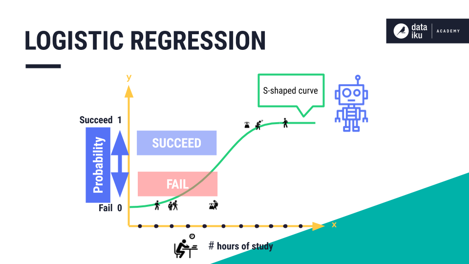
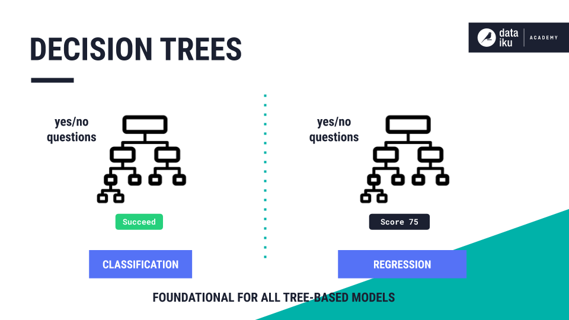
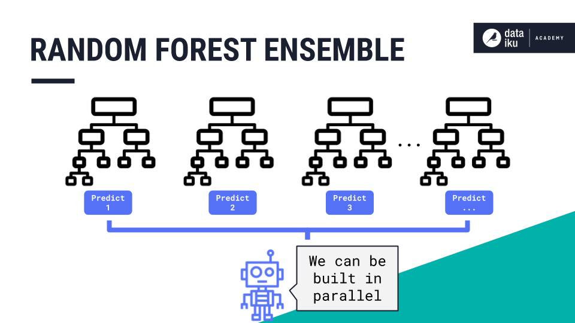
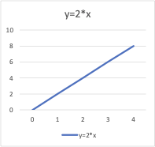
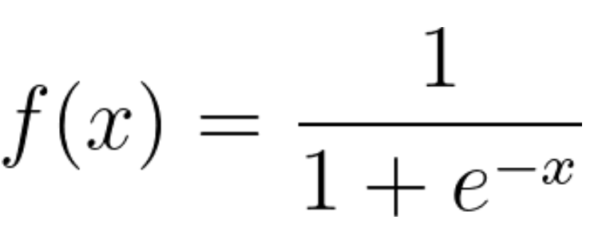
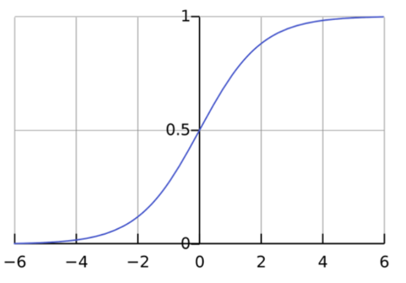
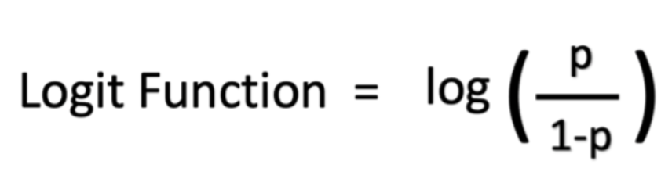
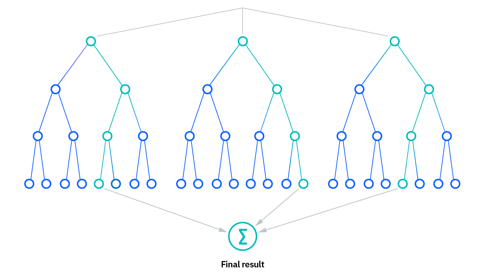
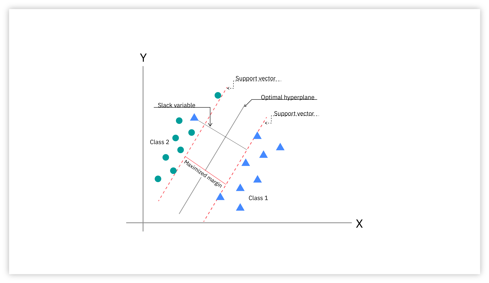

# Assignment 6

**1. Introduction to Classification**

- What is Classification?
Definition
Classification is a type of supervised learning where the goal is to categorize data into predefined classes or labels. The output variable in classification is discrete, meaning it belongs to a fixed set of categories.[1]

- How is it different from regression?

Classification — where the goal is to categorize data into distinct classes. while Regression — where the goal is to predict a continuous numerical value.

- Give one real-life example of classification and one of regression.
  - classification: Medical Diagnosis: Predicting whether a patient has Diabetes or No Diabetes based on medical records.
  - Regression: Weather Forecasting: Estimating the temperature for the next week.

**2A. Classification Algorithms**

## Definitions

- ***Logistic Regression:*** Let’s compare logistic regression with linear regression. Linear regression is a prediction algorithm we learned about in the Regression section. In linear regression, we attempt to predict the student’s exact exam score. This generates a straight line of best fit to model the data points.
With logistic regression, we attempt to predict a class label–whether the student will succeed or fail on their exam. Here, the line of best fit is an S-shaped curve, also known as a Sigmoid curve.
Let’s compare logistic regression with linear regression. Linear regression is a prediction algorithm we learned about in the Regression section. In linear regression, we attempt to predict the student’s exact exam score. This generates a straight line of best fit to model the data points.
With logistic regression, we attempt to predict a class label–whether the student will succeed or fail on their exam. Here, the line of best fit is an S-shaped curve, also known as a Sigmoid curve.
Let’s compare logistic regression with linear regression. Linear regression is a prediction algorithm we learned about in the Regression section. In linear regression, we attempt to predict the student’s exact exam score. This generates a straight line of best fit to model the data points.
With logistic regression, we attempt to predict a class label–whether the student will succeed or fail on their exam. Here, the line of best fit is an S-shaped curve, also known as a Sigmoid curve.[2]

- ***Decision Trees:*** are another type of algorithm most frequently used for classification. Decision trees can also be used for regression. Instead of being limited to a single linear boundary, as in logistic regression, decision trees partition the data based on either/or questions.
When decision trees are used In classification, the final nodes are classes, such as “succeed” or “fail”. In regression, the final nodes are numerical predictions, rather than class labels. A decision tree is the foundation for all tree-based models, including Random Forest.[2]

- ***Random Forest:*** is an ensemble of decision trees where many trees, which may be weak on their own, come together to generate one strong guess. Each tree represents randomness: (a) because the dataset sample used to build it is random, and, (b) the subset of the model’s features used to evaluate each split is random. The trees aren’t correlated with one another in any way, and they can be built in parallel.[2]

## For each algorithm, explaination

- How it works (basic idea)
  - How does the logistic regression model work?
    To understand the logistic regression model, let’s first understand equations and variables.
Equations
In mathematics, equations give the relationship between two variables: x and y. You can use these equations, or functions, to plot a graph along the x-axis and y-axis by putting in different values of x and y. For instance, if you plot the graph for the function y = 2*x, you will get a straight line as shown below. Hence this function is also called a linear function.

Variables
In statistics, variables are the data factors or attributes whose values vary. For any analysis, certain variables are independent or explanatory variables. These attributes are the cause of an outcome. Other variables are dependent or response variables; their values depend on the independent variables. In general, logistic regression explores how independent variables affect one dependent variable by looking at historical data values of both variables.
In our example above, x is called the independent variable, predictor variable, or explanatory variable because it has a known value. Y is called the dependent variable, outcome variable, or response variable because its value is unknown.
Logistic regression function
Logistic regression is a statistical model that uses the logistic function, or logit function, in mathematics as the equation between x and y. The logit function maps y as a sigmoid function of x.

If you plot this logistic regression equation, you will get an S-curve as shown below.

As you can see, the logit function returns only values between 0 and 1 for the dependent variable, irrespective of the values of the independent variable. This is how logistic regression estimates the value of the dependent variable. Logistic regression methods also model equations between multiple independent variables and one dependent variable.
Logistic regression analysis with multiple independent variables
In many cases, multiple explanatory variables affect the value of the dependent variable. To model such input datasets, logistic regression formulas assume a linear relationship between the different independent variables. You can modify the sigmoid function and compute the final output variable as
y = f(β0 + β1x1 + β2x2+… βnxn)
The symbol β represents the regression coefficient. The logit model can reverse calculate these coefficient values when you give it a sufficiently large experimental dataset with known values of both dependent and independent variables.
Log odds
The logit model can also determine the ratio of success to failure or log odds. For example, if you were playing poker with your friends and you won four matches out of 10, your odds of winning are four sixths, or four out of six, which is the ratio of your success to failure. The probability of winning, on the other hand, is four out of 10.
Mathematically, your odds in terms of probability are p/(1 - p), and your log odds are log (p/(1 - p)). You can represent the logistic function as log odds as shown below[3]:

- How does the Random forest model work?
Random forest algorithms have three main hyperparameters, which need to be set before training. These include node size, the number of trees, and the number of features sampled. From there, the random forest classifier can be used to solve for regression or classification problems.
The random forest algorithm is made up of a collection of decision trees, and each tree in the ensemble is comprised of a data sample drawn from a training set with replacement, called the bootstrap sample. Of that training sample, one-third of it is set aside as test data, known as the out-of-bag (oob) sample, which we’ll come back to later. Another instance of randomness is then injected through feature bagging, adding more diversity to the dataset and reducing the correlation among decision trees. Depending on the type of problem, the determination of the prediction will vary. For a regression task, the individual decision trees will be averaged, and for a classification task, a majority vote—i.e. the most frequent categorical variable—will yield the predicted class. Finally, the oob sample is then used for cross-validation, finalizing that prediction[4].

- How does the Decision Tree model work?

1. Start with the Root Node: It begins with a main question at the root node which is derived from the dataset’s features.

2. Ask Yes/No Questions: From the root, the tree asks a series of yes/no questions to split the data into subsets based on specific attributes.

3. Branching Based on Answers: Each question leads to different branches:
If the answer is yes, the tree follows one path.
If the answer is no, the tree follows another path.
4. Continue Splitting: This branching continues through further decisions helps in reducing the data down step-by-step.

5. Reach the Leaf Node: The process ends when there are no more useful questions to ask leading to the leaf node where the final decision or prediction is made.
Let’s look at a simple example to understand how it works. Imagine we need to decide whether to drink coffee based on the time of day and how tired we feel. The tree first checks the time:

    1. In the morning: It asks “Tired?”
If yes, the tree suggests drinking coffee.
If no, it says no coffee is needed.
    2. In the afternoon: It asks again “Tired?”
If yes, it suggests drinking coffee.
If no, no coffee is needed.[5]

**2B. I choosed A support vector machine (SVM)**

A support vector machine (SVM) is a supervised machine learning algorithm that classifies data by finding an optimal line or hyperplane that maximizes the distance between each class in an N-dimensional space.

SVMs were developed in the 1990s by Vladimir N. Vapnik and his colleagues, and they published this work in a paper titled "Support Vector Method for Function Approximation, Regression Estimation, and Signal Processing"1 in 1995.

SVMs are commonly used within classification problems. They distinguish between two classes by finding the optimal hyperplane that maximizes the margin between the closest data points of opposite classes. The number of features in the input data determine if the hyperplane is a line in a 2-D space or a plane in a n-dimensional space. Since multiple hyperplanes can be found to differentiate classes, maximizing the margin between points enables the algorithm to find the best decision boundary between classes. This, in turn, enables it to generalize well to new data and make accurate classification predictions. The lines that are adjacent to the optimal hyperplane are known as support vectors as these vectors run through the data points that determine the maximal margin.

The SVM algorithm is widely used in machine learning as it can handle both linear and nonlinear classification tasks. However, when the data is not linearly separable, kernel functions are used to transform the data higher-dimensional space to enable linear separation. This application of kernel functions can be known as the “kernel trick”, and the choice of kernel function, such as linear kernels, polynomial kernels, radial basis function (RBF) kernels, or sigmoid kernels, depends on data characteristics and the specific use case.

Building a SVM classifier
Split your data
As with other machine learning models, start by splitting your data into a training set and testing set. As an aside, this assumes that you’ve already conducted an exploratory data analysis on your data. While this is technically not necessary to build a SVM classifier, it is good practice before using any machine learning model as this will give you an understanding of any missing data or outliers.

Generate and evaluate the model
Import an SVM module from the library of your choosing, like scikit-learn (link resides outside ibm.com). Train your training samples on the classifier and predict the response. You can evaluate performance by comparing accuracy of the test set to the predicted values. You may want to use other evaluation metrics, like f1-score, precision, or recall.[6]

**3. Classification Metrics**

- ***Accuracy:*** Measures the overall correctness of a classification model. It is calculated as the ratio of correctly predicted instances to the total number of instances.
- ***Precision:*** Measures the accuracy of the positive predictions made by the model. It's useful when minimizing false positives is crucial.
- ***Recall (Sensitivity):*** Measures the model's ability to identify all actual positive cases. It's important when avoiding false negatives is more critical.
- ***F1-Score:*** Combines precision and recall into a single value, providing a balance between the two. It's the harmonic mean of precision and recall and is useful for imbalanced datasets.
- ***Confusion Matrix:*** A table used to evaluate a classification model's performance by comparing actual and predicted class labels. It breaks down predictions into:
  - **True Positives (TP):** Correctly predicted positive cases.
  - **True Negatives (TN):** Correctly predicted negative cases.
  - **False Positives (FP) (Type 1 error):** Incorrectly predicted positive cases.
  - **False Negatives (FN) (Type 2 error):** Incorrectly predicted negative cases.[7]

| Metric               | When to Use                                                                  | What It Focuses On                             | Weaknesses                                                                                                 |
| -------------------- | ---------------------------------------------------------------------------- | ---------------------------------------------- | ---------------------------------------------------------------------------------------------------------- |
| **Accuracy**         | When classes are **balanced** and all errors are equally important           | Overall correctness (TP + TN over total cases) | Misleading with **imbalanced datasets** (e.g., 95% accuracy by always predicting majority class)           |
| **Precision**        | When **false positives** are costly (e.g., spam detection, fraud alerts)     | Quality of positive predictions                | Ignores false negatives → may miss many actual positives                                                   |
| **Recall**           | When **false negatives** are costly (e.g., cancer detection, safety systems) | Ability to find all positives                  | Ignores false positives → may incorrectly classify many negatives as positives                             |
| **F1-Score**         | When you need a **balance** between precision and recall (imbalanced data)   | Harmonic mean of precision and recall          | Harder to interpret than accuracy; not ideal if one metric (precision or recall) is clearly more important |
| **Confusion Matrix** | When you want a **detailed breakdown** of model performance                  | Provides counts of TP, TN, FP, FN              | Not a single metric; harder to compare models at a glance                                                  |

>this from chatJPT

**4. Imbalanced Data Problem**

Imbalanced data in classification refers to a dataset where the distribution of instances across different classes is not equal. This is a common problem in machine learning, where the majority class significantly outnumbers the minority class. For example, in fraud detection, the vast majority of transactions are genuine (majority class), while only a small fraction are fraudulent (minority class).[8]

***Why accuracy is a misleading metric for imbalanced data***
Accuracy, which is the ratio of correct predictions to total predictions, can be highly misleading for imbalanced datasets because a model can achieve a high accuracy score by simply predicting the majority class for all instances.[9]

For instance, in a fraud detection dataset with 99% non-fraudulent and 1% fraudulent transactions, a naive model that predicts every transaction as non-fraudulent will achieve 99% accuracy. This high score appears excellent but is completely useless, as the model fails to identify the minority class of interest (fraudulent transactions) entirely.[8]

***Better metrics for evaluating models with imbalanced data***
Since accuracy is unreliable, more informative metrics that focus on the model's performance on the minority class should be used. The best metrics depend on the specific business problem and the costs associated with different types of errors (false positives vs. false negatives).[10]

***Precision***
Precision measures the proportion of positive predictions that were actually correct. It focuses on the quality of positive predictions.[11]

- **Formula:** Precision \(=\frac{\text{True\ Positives}}{\text{True\ Positives}+\text{False\ Positives}}\)
- **When to use:** Precision is most important when the cost of a false positive is high. For example, in spam detection, a high precision model is desired to avoid mistakenly flagging a legitimate email as spam.[10]

**Recall (Sensitivity)** Recall measures the proportion of actual positive cases that were correctly identified by the model. It focuses on finding all positive instances.[11]

- **Formula:** Recall \(=\frac{\text{True\ Positives}}{\text{True\ Positives}+\text{False\ Negatives}}\)
- **When to use:** Recall is critical when the cost of a false negative is high. In disease screening, for instance, a high recall model is essential to ensure that as many sick patients as possible are identified, even if it results in some false positives.[10]

**F1-Score**
The F1-score is the harmonic mean of precision and recall. It provides a single score that balances both metrics and is a good measure for imbalanced datasets where both false positives and false negatives are important.

- **Formula:** F1-Score \(=2\times \frac{\text{Precision}\times \text{Recall}}{\text{Precision}+\text{Recall}}\)
- **When to use:** Use the F1-score when a balanced performance between precision and recall is needed.[12]

**ROC-AUC**
The Receiver Operating Characteristic (ROC) curve plots the True Positive Rate (recall) against the False Positive Rate at various classification thresholds. The Area Under the Curve (AUC) summarizes the curve's performance.

- **What it measures:** AUC-ROC quantifies a model's ability to distinguish between positive and negative classes across all possible thresholds.
- **Interpretation for imbalanced data**: Recent research has found that the ROC-AUC is robust to class imbalance, meaning a constant AUC score can be observed even as the class imbalance changes. However, a related metric, the Area Under the Precision-Recall Curve (PR-AUC), is often preferred in highly skewed datasets because it provides a more representative view of performance on the minority class.[13]

**Precision-Recall Curve (PR-AUC)**
The Precision-Recall curve plots precision against recall for different thresholds. The Area Under the Precision-Recall Curve (PR-AUC) provides a single score for this curve.

- **What it measures:** It emphasizes the model's ability to perform well on the minority (positive) class.
- **When to use:** PR-AUC is especially informative for highly imbalanced datasets where the minority class is the focus of the analysis. The score is highly sensitive to changes in the class imbalance, providing a realistic estimate of performance on a specific dataset.[13]

**5. Real-World Case Study**
we get this study of CUSTOMER CHURN PREDICTION MODEL IN
TELECOMMUNICATION SECTOR USING MACHINE
LEARNING TECHNIQUE

- ***The goal of the project:***
The major goal of this system is to analyze the diversified machine learning algorithms which are required to develop customer churn prediction models and identify churn reasons in order to give them with retention strategies and plans.

- ***The data they used***
The dataset used for experiments in this paper, contains results of Telco-Customer-Churn dataset obtained from Kaggle website (it is also known as IBM Watson dataset which was released in 2015).Each row represents a customer, each column contains attribute described on the column Metadata. It consists of 7043 customer information. Every customer has 21 features and the “Churn” it contains 11 missing values in the Total Charges column. The last attribute contains labelled data with two classes where 26.53 % of total customers are labelled as ‘‘T’’ indicating true customers i.e., categorized as churning customers and the remaining 73.46 % customers are labelled as ‘‘F’’ indicating false customers i.e., categorized as non-churning customers. The attribute selection depends on the results of techniques of feature selection that find useful, the most similar and effective attributes to predict the churning customers. A total of 5174 are non-churners and 1869 are churners. The dataset contains 16 categorical columns and 5 numeric columns. The dataset helps to figure out customer prophecy and build retention possibilities.

- ***The classification model applied***
This system uses classification techniques to find out the leave subscriptions and collects the reasons behind the leave subscription of customers in the telecom industry. The major goal of this system is to analyze the diversified machine learning algorithms which are required to develop customer churn prediction models and identify churn reasons in order to give them with retention strategies and plans. In this system, leave subscriptions collects customers' data by applying classification algorithms such as Random Forest (RF), machine learning techniques such as KNN and decision tree Classifier.

- ***The key results or insights***
System achieves an accuracy of 99 % using the random forest classifier for churn predicts, the classifier matrix has achieved a precision of 99 % with a recall factor of 99 % alongwith received overall accuracy of 99.09 %. Likewise, our research work improves churn prediction, scope other business fields, and provide prediction models to hold their existing customers customer service, and avoid churn effectively.

**References**
[1]:<https://medium.com/skillcamper/difference-between-classification-and-regression-algorithms-use-cases-metrics-d1e2d1d0355a>
[2]:<https://knowledge.dataiku.com/latest/ml-analytics/ml-concepts/concept-classification.html>
[3]:<https://aws.amazon.com/what-is/logistic-regression/#:~:text=Logistic%20regression%20is%20a%20data,outcomes%2C%20like%20yes%20or%20no>.
[4]:<https://www.ibm.com/think/topics/random-forest#:~:text=for%20more%20information.-,How%20it%20works,%2Dvalidation%2C%20finalizing%20that%20prediction>.
[5]:<https://www.geeksforgeeks.org/machine-learning/decision-tree/>
[6]:<https://www.ibm.com/think/topics/support-vector-machine#:~:text=How%20SVMs%20work-,What%20are%20SVMs?,that%20determine%20the%20maximal%20margin>.
[7]:<https://developers.google.com/machine-learning/crash-course/classification/accuracy-precision-recall#:~:text=(Optional%2C%20advanced)%20F1%20score,to%20whichever%20metric%20is%20worse>.
[8]:<https://www.kaggle.com/code/marcinrutecki/best-techniques-and-metrics-for-imbalanced-dataset>
[9]:<https://medium.com/@becaye-balde/why-is-accuracy-misleading-9465975fa429>
[10]:<https://medium.com/cuenex/advanced-evaluation-metrics-for-imbalanced-classification-models-ee6f248c90ca>
[11]:<https://machinelearningmastery.com/precision-recall-and-f-measure-for-imbalanced-classification/>
[12]:<https://sebastianraschka.com/faq/docs/computing-the-f1-score.html>
[13]:<https://medium.com/data-science/imbalanced-data-stop-using-roc-auc-and-use-auprc-instead-46af4910a494>
