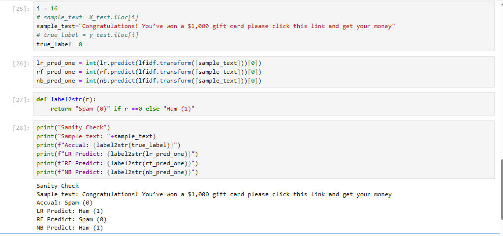
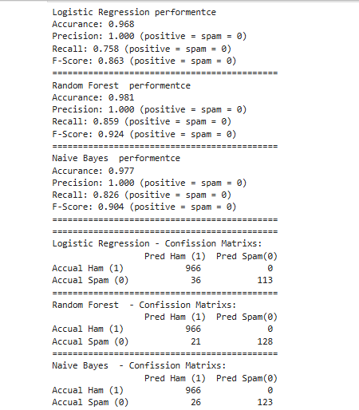

# Part B – Reflection Paper

1. ***What did you implement?***
In this project, I implemented three different machine learning algorithms — Logistic Regression, Random Forest, and Naive Bayes — to detect spam messages from a dataset of emails. I preprocessed the text using TF-IDF Vectorization, which converts words into numerical features, and then trained each model on 80% of the dataset while reserving 20% for testing. Finally, I evaluated the models using accuracy, precision, recall, F1-score, and confusion matrices, as well as tested them with custom “sanity check” messages.
2. ***Comparison of Models:***
I tested the three models with a spam-like sample message:
"Congratulations! You’ve won a $1,000 gift card please click this link and get your money."

- **True Label (from dataset):** Spam (0)

- **Logistic Regression Prediction:** Ham (1)

- **Random Forest Prediction:** Spam (0)

- **Naive Bayes Prediction:** Ham (1)

Here, only Random Forest matched the true label and correctly identified the message as spam. Logistic Regression and Naive Bayes misclassified it as ham, which is a serious error because it would let spam into a user’s inbox. This shows that Random Forest is better at detecting strong spam keywords in this case.

3. Understanding Naive Bayes

3. ***Understanding Naive Bayes:***

- **What is Naive Bayes?**
Naive Bayes is a probabilistic classification algorithm based on Bayes’ Theorem. It assumes that all features (words in the email) are independent of each other — an assumption that is not fully true in real life, but works surprisingly well.

- **Why is it used in spam detection?**
Naive Bayes works particularly well for text classification problems like spam detection because it can quickly estimate probabilities of a message being spam or ham based on the frequency of words. For example, words like “free,” “winner,” or “prize” are much more likely to appear in spam than in legitimate emails.

- **Advantages:**
Very fast to train and predict.
Performs well on high-dimensional text data.
Requires relatively little training data.

- **Limitations:**
Assumes independence of features (which is not realistic).
Can struggle if the dataset is small or very unbalanced.
Sometimes less accurate than more complex models like Random Forest.

4. ***Metrics Discussion:***

- Logistic Regression
  - Accuracy: 0.968
  - Precision: 1.000 (never predicted spam incorrectly as ham)
  - Recall: 0.758 (missed many spam messages → 36 false negatives)
  - F1-Score: 0.863

  - Confusion Matrix Insight: Excellent at identifying ham (966/966 correct), but weaker on spam (only 113/149 spam detected).

- Random Forest

  - Accuracy: 0.981

  - Precision: 1.000

  - Recall: 0.859 (caught more spam than Logistic Regression → only 21 false negatives)

  - F1-Score: 0.924

  - Confusion Matrix Insight: Very balanced, detected both ham and spam well. 128/149 spam messages were caught correctly.

- Naive Bayes

  - Accuracy: 0.977

  - Precision: 1.000

  - Recall: 0.826 (middle ground → 26 false negatives)

  - F1-Score: 0.904

  - Confusion Matrix Insight: Like Logistic Regression, perfect on ham (966/966), but slightly weaker on spam than Random Forest (123/149 detected).

5. ***My Findings & Recommendation***

- All three models had perfect precision (1.0), which means none of them misclassified ham as spam (no false positives). This is very good because it avoids wrongly flagging legitimate emails.
- The main difference comes from recall (ability to catch spam):
  - **Logistic Regression** missed 36 spam emails.
  - **Naive Bayes** missed 26 spam emails.
  - **Random Forest** missed only 21 spam emails.

Since false negatives (spam being misclassified as ham) are the most dangerous in a spam detection system, **Random Forest performed the best overall.** It achieved the highest recall (0.859) and F1-score (0.924), while maintaining perfect precision and high accuracy (0.981).

✅ **Recommendation:** I would recommend Random Forest as the best model for spam detection. It provides the best balance between catching spam and avoiding false alarms, making it more reliable for real-world deployment.
