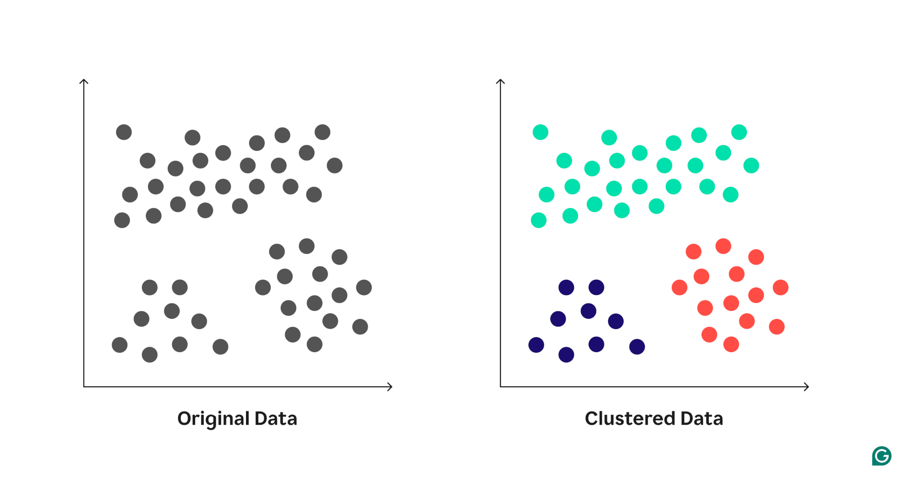
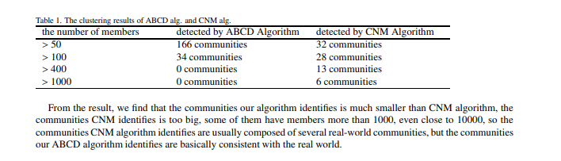

# Assignment 8

1. **Introduction to Clustering**

- ***What is clustering in machine learning?***
Clustering is an unsupervised learning technique used in ML to group data points into clusters based on their similarities. Each cluster contains data points that are more similar to one another than to points in other clusters. This process helps uncover natural groupings or patterns in data without requiring any prior knowledge or labels.[1]
Clustering in machine learning:

- ***How is it different from supervised learning (regression/classification)?***
Clustering vs. classification: What’s the difference?
Clustering and classification are often compared but serve different purposes. Clustering, an unsupervised learning method, works with unlabeled data to identify natural groupings based on similarities. In contrast, classification is a supervised learning method that requires labeled data to predict specific categories.
Clustering reveals patterns and groups without predefined labels, making it ideal for exploration. Classification, on the other hand, assigns explicit labels, such as “cat” or “dog,” to new data points based on prior training. Classification is mentioned here to highlight its distinction from clustering and help clarify when to use each approach.[1]

- ***Give one real-life example of clustering and one of supervised learning.***
**Image segmentation - clusterting**
In image analysis, clustering groups similar pixel regions, segmenting an image into distinct objects. In healthcare, this technique is used to identify tumors in medical scans like MRIs. In autonomous vehicles, clustering helps differentiate pedestrians, vehicles, and buildings in input images, improving navigation and safety.[1]
**Loan Default Prediction - supervisor**
Problem: Will a customer default on a loan?
How it works: Banks use models trained on past customer data—income, credit score, repayment history—to predict loan risk.[2]

2. **Clustering Algorithms**

- **k-means Clustering**
The k-means algorithm is one of the most widely recognized and implemented clustering techniques in machine learning. Its core principle revolves around partitioning a dataset into k distinct, non-overlapping clusters.
To understand the mechanics, consider a dataset X. The objective of k-means is to determine k centroids and assign each data point to the nearest centroid. These centroids, which represent the center of the clusters, are initialized randomly or based on specific heuristics.
The algorithm iteratively performs two primary steps:
Assignment Step: Assign each data point in X to the nearest centroid. This assignment is typically based on the Euclidean distance, although other distance metrics can be employed.
Update Step: Calculate the mean of the data points assigned to each centroid and set this mean as the new centroid.
This iterative process continues until the centroids no longer change significantly or a set number of iterations is reached.[3]

- **Hierarchical Clustering**
Hierarchical clustering is a method that seeks to build a hierarchy of clusters either through a bottom-up or top-down approach. In contrast to k-means, which partitions data into distinct clusters, hierarchical clustering creates a tree of clusters, offering multiple levels of granularity.
The bottom-up approach, known as agglomerative clustering, starts by treating each data point as a single cluster and then successively merging the closest pairs of clusters. This process repeats until only one large cluster remains, encompassing all data points.
On the other hand, the top-down approach, called divisive clustering, begins with all data points in a single cluster and then proceeds to divide them into smaller clusters until each data point forms its own cluster.
One of the notable outcomes of hierarchical clustering is the dendrogram, a tree-like diagram that illustrates the sequence of merges or splits. This visualization can be particularly useful in understanding the hierarchical structure of data.[3]

- **DBSCAN**
DBSCAN is a density-based clustering algorithm that segregates data points into high-density regions separated by regions of low density. Unlike k-means or hierarchical clustering, which require specifying the number of clusters beforehand, DBSCAN automatically determines clusters based on the density of data points.[3]
**The fundamental concepts driving DBSCAN are core points, border points, and noise points:**

  - **Core Points:** A point is considered a core point if there are at least MinPts number of points (including itself) within a radius ε of it.
  - **Border Points:** These are points that are not core points themselves but fall within the ε radius of a core point.
  - **Noise Points:** Points that are neither core nor border points. These are often outliers or data points in low-density regions.

**The DBSCAN algorithm works as follows:**

1. Start with an arbitrary point. If there are MinPts within ε distance of this point, establish a new cluster and include all points within this distance.
2. Expand the cluster by checking all points within ε distance of every point in the cluster. If any of these new points have at least MinPts within ε distance of them, add them to the cluster.
3. Continue the process until no more points can be added to the cluster. Then, move on to the next unvisited point and repeat the process.
4. Points that don't belong to any cluster are labeled as noise.

**Real world use case**
**Clustering Customer Data**
Assume you have customer data from an e-commerce site with features like age, income, and purchase frequency.[4]

- **K-Means** can segment customers into groups like “budget shoppers,” “frequent buyers,” etc.
- **DBSCAN** can detect anomalies such as fake accounts or rare high-spending customers.
- **Hierarchical** Clustering can reveal nested patterns, such as customer subtypes within broader categories.

**Main advantages and limitations**
***Advantages of k-means***.[5]

- Relatively simple to implement.
- Scales to large data sets.
- Always converges.
- Allows warm-starting the positions of centroids.
- Smoothly adapts to new examples.
- Can be generalized to clusters of different shapes and sizes, such as elliptical clusters.

***Limitation of k-means***.[5]

- must be chosen manually.

- Results depend on initial values.
- Difficulty clustering data of varying sizes and densities without generalization.
- Difficulty clustering outliers.
- Difficulty scaling with number of dimensions.

***Advantages of DBSCAN***.[6]

- Can find arbitrarily shaped clusters
- Does not require the number of clusters in advance
- Handles noise and outliers well

***Limitation of DBSCAN***.[6]

- Struggles with varying density
- Sensitive to parameter selection

***Advantages of Hierarchical***.[6]

- No need to predefine number of clusters
- Dendrogram provides detailed cluster structure
- Works well for hierarchical relationships

***Limitation of Hierarchical***.[6]

- High time complexity (O(n2))
- Sensitive to noise and outliers
- Not scalable for large datasets

3. **Clustering Metrics**

- **Silhouette (clustering)**
The silhouette value is a measure of how similar an object is to its own cluster (cohesion) compared to other clusters (separation). The silhouette value ranges from −1 to +1, where a high value indicates that the object is well matched to its own cluster and poorly matched to neighboring clusters. If most objects have a high value, then the clustering configuration is appropriate. If many points have a low or negative value, then the clustering configuration may have too many or too few clusters. A clustering with an average silhouette width of over 0.7 is considered to be "strong", a value over 0.5 "reasonable", and over 0.25 "weak". However, with an increasing dimensionality of the data, it becomes difficult to achieve such high values because of the curse of dimensionality, as the distances become more similar. The silhouette score is specialized for measuring cluster quality when the clusters are convex-shaped, and may not perform well if the data clusters have irregular shapes or are of varying sizes. The silhouette value can be calculated with any distance metric, such as Euclidean distance or Manhattan distance.[7]

- **Davies–Bouldin index**
The Davies–Bouldin index (DBI), introduced by David L. Davies and Donald W. Bouldin in 1979, is a metric for evaluating clustering algorithms. This is an internal evaluation scheme, where the validation of how well the clustering has been done is made using quantities and features inherent to the dataset. This has a drawback that a good value reported by this method does not imply the best information retrieval.[8]

- **Elbow method (clustering)**
In cluster analysis, the elbow method is a heuristic used in determining the number of clusters in a data set. The method consists of plotting the explained variation as a function of the number of clusters and picking the elbow of the curve as the number of clusters to use. The same method can be used to choose the number of parameters in other data-driven models, such as the number of principal components to describe a data set.[9]

| **Metric**                        | **What it Measures**                                                                                   | **Good Value**                                                                                                         | **When It’s Most Useful**                                                                                 |
| --------------------------------- | ------------------------------------------------------------------------------------------------------ | ---------------------------------------------------------------------------------------------------------------------- | --------------------------------------------------------------------------------------------------------- |
| **Elbow Method (WCSS / Inertia)** | Total squared distance of points to their cluster centroid (cluster compactness).                      | Look for the “elbow point” where WCSS stops decreasing sharply.                                                        | Quick heuristic to estimate *approximate* number of clusters before deeper evaluation.                    |
| **Silhouette Score**              | Balance between **cohesion** (within-cluster closeness) and **separation** (between-cluster distance). | Close to **+1** = well-separated clusters.   Around **0** = overlapping clusters.   Negative = wrong assignment. | Comparing clustering quality across different k values; detecting overlapping or poorly-defined clusters. |
| **Davies–Bouldin Index (DBI)**    | Ratio of cluster compactness to separation; compares each cluster with its most similar one.           | **Lower is better** → better separation and tighter clusters.                                                          | Choosing the best clustering when you want a single numeric score (objective evaluation).                 |

4. **Challenges in Clustering**

- Clustering is an unsupervised learning technique because it does not require labeled data. You don’t tell the model the group or category each data point belongs to; the model tries to figure out the groupings on its own.[10]

Major Concerns with Cluster Analysis.[11]

1. Selection of the Number of Clusters
One of the primary challenges in cluster analysis is determining the optimal number of clusters. This section will cover:
Problem Description: Why selecting the correct number of clusters is important.
Methods for Determination: Techniques such as the Elbow Method, Silhouette Score, and Gap Statistics.
Impact of Incorrect Selection: Overfitting with too many clusters and oversimplification with too few.

2. Scalability and Performance
Cluster analysis can be computationally intensive, especially with large datasets. Key points include:
Computational Complexity: How algorithms like K-means scale with data size.
Efficiency Considerations: Strategies for improving scalability, such as using approximate methods and parallel processing.
Big Data Challenges: Handling very large datasets in practical scenarios.

3. Handling High-Dimensional Data
High-dimensional data poses unique challenges for cluster analysis. This section addresses:
Curse of Dimensionality: Explanation and its effects on clustering.
Dimensionality Reduction Techniques: Using PCA, t-SNE, and other methods to reduce dimensionality while preserving data structure.
Trade-offs: Balancing dimensionality reduction and information loss.

5. **Real-World Case Study**.[12]

- ***Summary:***
  - **The goal of the project**
    This study mainly focuses on the **methodology of weighted graph clustering** with the purpose of community detection for large
scale networks such as the users’ relationship on Internet social networks
  - **The data they used**
    They tested the algorithm on three datasets:

    - **Sina Weibo (micro-blog)** – 70,000 users and 0.6 million bi-directional links (follows).

    - **College Football teams dataset** – represents games among U.S. college football teams (known ground-truth communities = conferences).

    - **Renren social network** – 86,000 users and 4.8 million friendships.

  - **The clustering model applied**
    The ABCD algorithm (Attractiveness-Based Community Detection).

  - **The key results or insights**
    - Sina Weibo dataset: ABCD detected smaller and more realistic communities than CNM. CNM often produced very large clusters (sometimes 1000+ users), which were actually multiple real communities grouped together.

    - College Football dataset: ABCD’s detected communities closely matched the known conferences, showing high reliability.

    - Renren dataset: Found many small, meaningful communities; very large detected groups (400+ members) were due to missing friendship data (privacy issues).
    - Overall: ABCD is more accurate, more memory-efficient, and scalable for large social networks compared to CNM.

        

**References**
[1]:<https://www.grammarly.com/blog/ai/what-is-clustering/#:~:text=Challenges%20in%20clustering-,What%20is%20clustering%20in%20machine%20learning?,interpret%20and%20name%20those%20clusters>.
[2]:<https://www.sanfoundry.com/supervised-learning-explained-with-examples/#google_vignette>
[3]:<https://hex.tech/blog/comparing-density-based-methods/#hierarchical-clustering>
[4]:<https://www.sanfoundry.com/clustering-methods-k-means-dbscan-hierarchical/>
[5]:<https://developers.google.com/machine-learning/clustering/kmeans/advantages-disadvantages#:~:text=For%20low%20%2C%20you%20can%20mitigate,the%20mean%20distance%20between%20examples>.
[6]:<https://www.sanfoundry.com/clustering-methods-k-means-dbscan-hierarchical/#6>
[7]:<https://en.wikipedia.org/wiki/Silhouette_(clustering)#:~:text=The%20silhouette%20score%20is%20specialized,Euclidean%20distance%20or%20Manhattan%20distance>.
[8]:<https://en.wikipedia.org/wiki/Davies%E2%80%93Bouldin_index#:~:text=The%20Davies%E2%80%93Bouldin%20index%20(DBI,imply%20the%20best%20information%20retrieval>.
[9]:<https://en.wikipedia.org/wiki/Elbow_method_(clustering)#:~:text=In%20cluster%20analysis%2C%20the%20elbow,Thorndike%20in%201953>.
[10]:<https://medium.com/@gremwang/clustering-and-classification-in-machine-learning-316f7b33f24f>
[11]:<https://www.geeksforgeeks.org/data-analysis/what-are-the-concerns-with-cluster-analysis/>
[12]:<https://www.researchgate.net/publication/262691718_Weighted_Graph_Clustering_for_Community_Detection_of_Large_Social_Networks#:~:text=Abstract%20and%20Figures,specify%20the%20number%20of%20clusters.&text=(a)%20A%20community%20that%20CNM,communities%20that%20ABCD%20algorithm%20identified.&text=(a)%20Renren%20Communities%20with%20members,members%20from%20200%20to%20250>.
