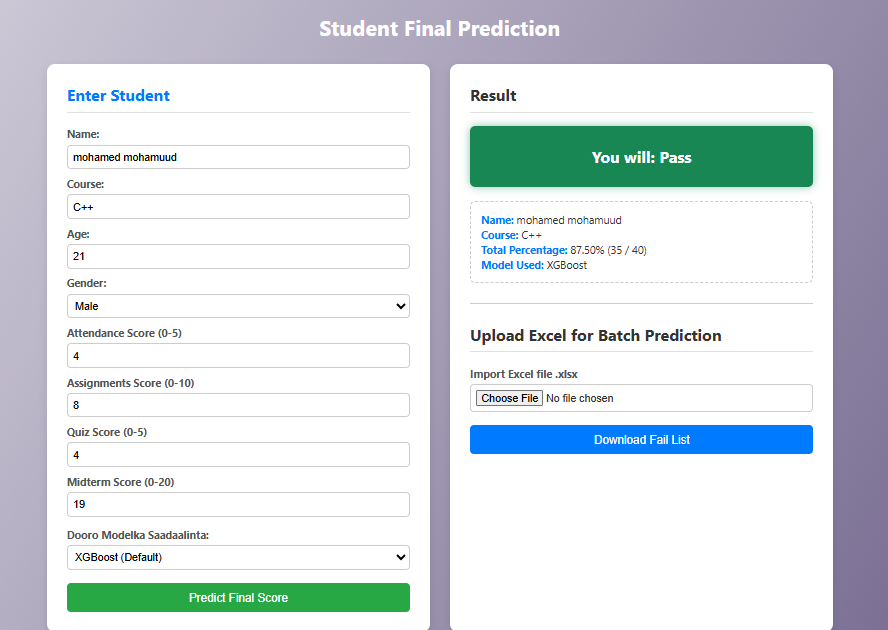
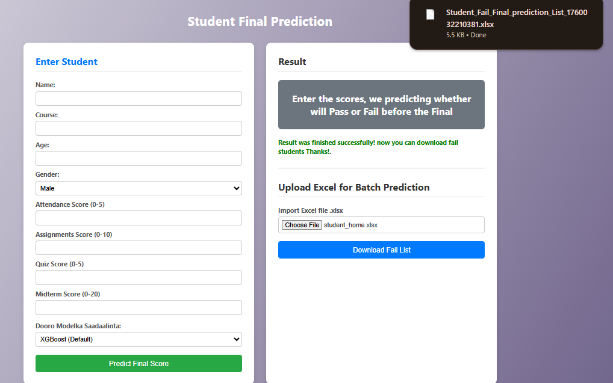
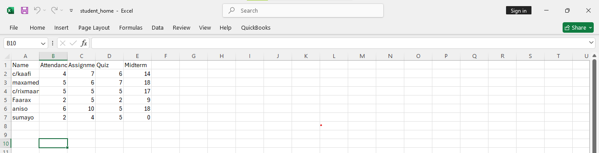
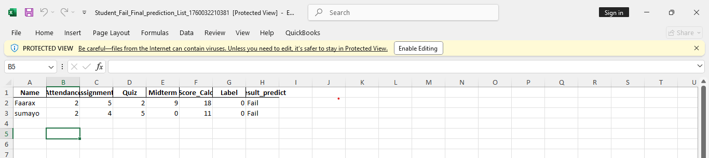

# 📖 Student_Final_Prediction -- ML Workflow

## 1: Problem definition

 **student final prediction** = hadafka wa in la sii sadaalin karo final ka ardeyga si maamulayaasha ardeyda liita muraajico u sameyan kuwa top ku jira la abaal mariyo, kuwa dhexe na la dhiiri galiyo, wana in xog cusub aqbali karaa, project gu waana Supervised qeybta Classfication.

### 2: Data collection

Dataset ku waa 1k+ ardey ah, 9 columns 8 ka mid ah waa **feutures** 1 waa **label**

### 3: Data cleaning & preprocessing

waxan ka saaray khaladaadka, meelaha banan oo aan buuxiyey, duplicate, iqr_function, feauture engineering, One Hot Encoding, save the scaler and training features, saved dataset

### 4: check images

###### single person check

###### upload file

###### before

###### after

### 5: Model selection

* Ka fiiri dhowr algorithm oo ku habboon haddii final score tiro yahay: Linear Regression, Random Forest Regressor, XGBoost) si aan u helo pass/fail.
* Samee **train/test split** (e.g., 80/20).

### 6: Model evaluation & comparisons

* Train/test split, scaler
* random forest, logistic regression, decition tree, xgboost
* single row sanit check
* custom inputs
* Metrics:
  * Classification =  Accuracy, Precision, Recall, F1-score
* saved models

### 7: Deployment & usage

* API (Flask) si xog cusub loo galiyo loona helo prediction
* frontend HTML + CSS + JS, si fudud loo arko

### 8: Monitoring & improvement

* Si joogto ah u cusbooneysii modelka marka xog cusub timaado
* Ka war hay haddii performance uu hoos u dhaco model drift
* kusoo daray feutures sida in excel lasoo galin karo

### 9: Working API deployment

### 9: Who uses it?

managers to decide whether students who fail the final exam at a school, university or college

### 10: 💡 How is it used?

Fadlan excel file kaaga columns kaan wa in ku jiran    **Attendance  Assignments  Quiz  Midterm**

weliba sida ay u qoran yihiin, **lakiin wax kale waad kuso darsan karta sida  name,age,gender,id**

**kadibna soo download gareyso list kaliya ah fail examka dhici raba finalka si aad uga hortagto oo aad murajico ugu sameyso**

### 11: 💡scores/ dhibcaha

1: Attendance = 0 ilaa 5                 2: Assignments = 0 ilaa 10

3: Quiz = 0 ilaa 5                           4: Midterm = 0 ilaa 20

* totalku waa 40          maadama u finalka yahay 60

---
